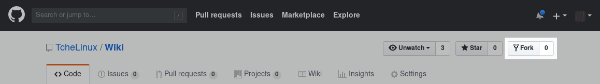
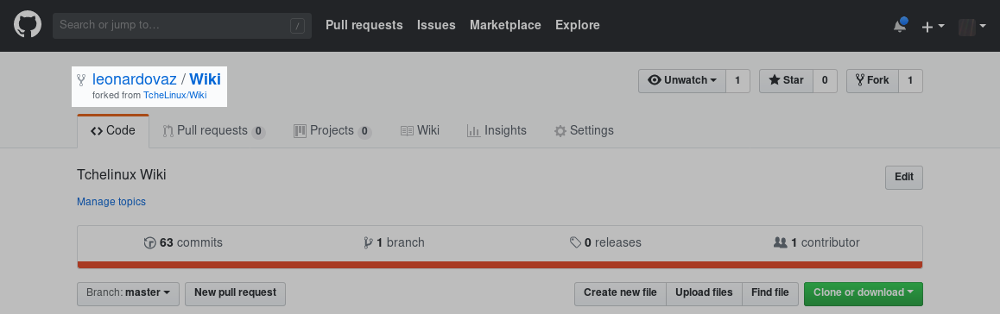
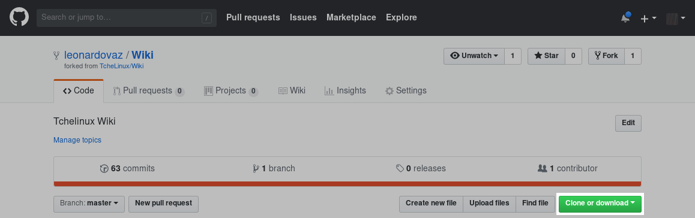

Como contribuir com este Wiki
=============================

*Importante:* Este documento ainda está em desenvolvimento e não está completo ainda.

## Sobre este documento

Este documento descreve os passos necessários para contribuição com o Wiki do Tchelinux.

## Visão geral do processo

Para contribuir com o Wiki é necessário clonar o repositório do Github, fazer as alterações, commitar as mudanças e criar um pull request para que as mudanças sejam adicionadas ao Wiki.

## Requisitos

- Uma conta no [Github](https://github.com/join)
- Conhecimentos básicos em [Markdown](https://guides.github.com/features/mastering-markdown/)
- Saber usar um editor de texto simples (Atom, Sublime, Gedit, Kate, Vim, Emacs, Nano etc) 
- Entendimento básico sobre como a ferramenta Git funciona (repositórios, branches, forks etc)

## Começando 

### Configure o Git

Caso o Git não esteja configurado, execute os comandos abaixo substituindo o nome e endereço de email. 

```
git config --global user.name "Fulano de Tal"
git config --global user.email fulano@dominio.com
```

### Crie um fork do repositório do Wiki

A partir de sua conta no Github, acesse o [repositório do wiki do Tchelinux](https://github.com/tchelinux/wiki.git) e clique no botão "Fork", conforme a figura abaixo:



Após o processo ser concluido, o Fork irá aparecer como um novo repositório na interface do Github:



Clique em no botão "Clone or Download" (botão verde), para copiar o endereço do repositório do Fork:



### Clonando o repositório

Use o endereço obtido no passo anterior para clonar o repositório:

```
git clone <endereço-do-repositório>
```

### Criando um branch de trabalho

```
cd wiki

git checkout master

git branch -b nova_pagina
```

### Fazendo a sua contribuição

```
cd docs

vim documento.md

```

### Gravando mudanças

```
git add documento.md

git commit -m "Novo Documento para o Wiki do Tchelinux"
```

### Enviando as alterações para seu fork do repositório

```
git push origin nova_pagina
```

## Criando um pull request


## Recursos externos

- [Livro Git Pro v2](https://git-scm.com/book/pt-br/v2)
