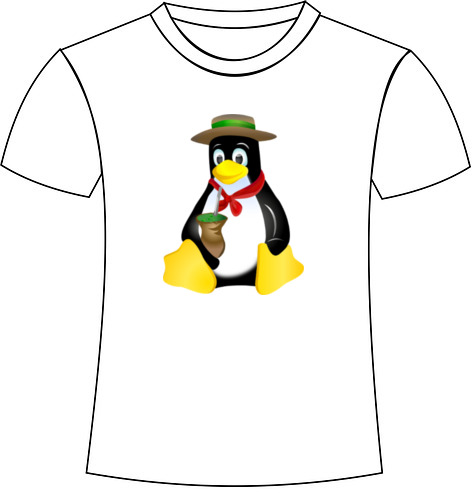
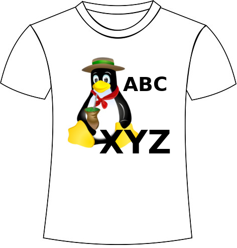

Tchelinux Eventos HOWTO
=======================

## Sobre este documento

Este documento descreve os requisitos necessários para a realização de eventos do Tchelinux com uma única sala (trilha) para público até 250 participantes.

## Sobre o Tchelinux

A paixão pelo Software Livre assim como o desejo de compartilhar conhecimentos fez com que um grupo de usuários se reunisse e trabalhasse junto na organização de eventos para a divulgação de ferramentas e da filosofia Open Source em instituições educacionais do Rio Grande do Sul.

Aproveitando a ideia de voluntariado, o grupo decidiu que os eventos seriam sempre gratuitos, porém os participantes são encorajados a doar 2kg de alimentos não-perecíveis, que são doados a instituições de caridade da cidade onde ocorre o evento.

Desde Outubro de 2006 o Tchelinux realizou mais de 80 eventos com o auxílio de centenas de voluntários, que ajudaram na organização e apresentaram palestras que foram assistidas por mais de 10 mil pessoas que doaram mais de 16 toneladas de alimentos para instituições de caridade.

### Missão

A Missão do Tchelinux é divulgar e difundir o uso do Software Livre por estudantes no estado do Rio Grande do Sul, incentivando sua adoção e também encorajar o empreendedorismo.

### Visão

Os membros do Tchelinux acreditam que através de suas iniciativas podem contribuir para o desenvolvimento do Software Livre e também gerar oportunidades para as gerações futuras.

### Valores

Os principais valores do Tchelinux são: meritocracia, transparência, ética, respeito e compromisso.

## Planejando um evento

### Equipe de organização

A organização de eventos do Tchelinux requer que uma série de tarefas sejam realizadas muitas vezes em paralelo, e para haver uma boa divisão do trabalho e não ocorrer nenhum tipo de sobrecarga dos voluntários recomenda-se que um grupo de pelo menos 3 pessoas esteja coordenando as atividades.

Além da equipe de organização recomenda-se que ao menos 1 pessoa seja designada pela instituição onde o evento irá ocorrer (Universidade, Faculdade, Curso Técnico etc) para servir como ponto central de contato, assim como na alocação de recursos.

### Definindo o cronograma

Tendo como base o retrospecto de eventos realizados pelo Tchelinux recomenda-se que uma estrutura de cronograma como a da tabela abaixo seja pela equipe de organização:

| Tarefa                                                          | Antedência recomendada  |
| ------                                                          |------                   |
| Planejamento do evento                                          | 90 dias                 |
| Anúncio do evento em redes sociais                              | 70 dias                 |
| Publicação do site do evento                                    | 70 dias                 |
| Início da chamada de trabalhos                                  | 70 dias                 |
| Encerramento da chamada de trabalhos                            | 45 dias                 |
| Anúncio da programação do evento                                | 40 dias                 |
| Abertura das inscrições                                         | 40 dias                 |
| Divulgação do evento                                            | 40 dias                 |

## Escolhendo a Instituição

A escolha de uma Instituição para a realização de um evento é possivelmente uma das decisões mais importantes a serem tomadas pela equipe de organização pois fatores como localização e a infraestrutura contribuem para o sucesso do evento. 

Alguns pontos importantes a serem considerados ao escolher uma instituição para a realização de um evento do Tchelinux:

### Localização

Um dos critérios mais importantes na escolha da instituição que irá receber o evento é a sua localização uma vez que locais de difícil acesso podem contribuir para que pessoas não compareçam ao evento.

Outro ponto que deve ser considerado é a segurança uma vez que várias pessoas irão participar do evento e o grupo precisa ter certeza que o local escolhido não apresenta nenhum tipo de risco para os participantes e a equipe de organização.

### Transporte

Como boa parte dos participantes dos eventos são estudantes é importante que existam opções de transportes públicos (linhas de ônibus, lotação, pontos de táxi etc) que circulem próximo a instituição e com disponibilidade de horário.

### Estacionamentos

É possível que existam participantes que optem por se deslocar até o local do evento utilizando transporte próprio (carros e motos) e é necessário que exista local para estacionamento, independentemente de ser gratuito ou pago.

### Infraestrutura

| Item                                             | Detalhes                                         |
|-------                                           |---------                                         | 
| Espaço para credenciamento | Ao chegar a uma instituição um dos primeiros locais acessados pelos participantes é o espaço para credenciamento onde é feita a identificação dos mesmos e também a entrega das doações. O espaço deve ser em um local de fácil acesso que permita a  colocação de mesas e a organização de filas. |
| Auditório ou Sala de Aula | Recomendamos que as apresentações sejam realizadas em um Auditório ou Sala de Aula com capacidade entre 70 a 250 lugares. É importante que o local seja de fácil acesso, bem iluminado, conte com um sistema de ventilação e tenha sinalização pra saída em caso de emergência. |
| Projetor Multimídia | O Auditório ou Sala de Aula onde as apresentações serão realizadas necessita ter um projetor multimídia para que palestrantes possam utilizá-los durante o evento, e é importante verificar o tipo de saída disponíveis nos aparelhos (VGA, HDMI, Displayport etc) assim como as resoluções suportadas para que adaptadores possam ser providenciados. |
| Acesso a Internet | É importante que a instituição sede do evento ofereça acesso a Internet para que palestrantes possam fazer suas demonstrações e para que participantes possam ter acesso ao site com informações sobre o evento (programação, detalhes sobre palestras etc). |
| Espaço para Coffee-Break | Nas edições mais recentes dos eventos do Tchelinux o grupo tem organizado um intervalo para a realização de Coffee-Breaks durante a parte da tarde e para isso se faz necessário que um espaço seja alocado. Dê preferência por espaços abertos como saguões ou corredores com espaço, onde possam ser dispostas mesas para garrafas e bandejas. |
| Restaurantes e Cantinas | Por tratar-se de eventos realizados durante praticamente um dia todo é essencial que existam opções para que participantes possam fazer uma refeição durante o intervalo do almoço (dentro ou fora da instituição) e também algum local onde possam comprar água, café ou fazer algum tipo de refeição rápida. É importante se certificar disso para evitar que os participantes necessitem voltar até suas casas ou se deslocarem para locais mais distantes por conta de não existir nenhum local disponível na instituição ou nas redondezas.
| Banheiros | É importante que existam banheiros no mesmo andar do Auditório (ou Sala de Aula) para evitar que os participantes tenham de se deslocar dentro da instituição durante o evento. 

## Escolhendo a data do evento

Um dos pontos mais importantes a serem observados na organização de eventos do Tchelinux é que os mesmos são organizados por voluntários em seu tempo livre e que as datas para realização dos mesmos devem ocorrer obrigatoriamente aos Sábados.

Antes de entrar em contato com uma instituição escolha duas ou três opções de datas observando os seguintes requisitos:

### Calendário do Tchelinux

Antes de entrar em contato com uma instituição certifique-que de verificar no [Calendário do Grupo](https://wiki.tchelinux.org/#!eventos/calendario.md) se não existe nenhum conflito de calendário.

### Intervalo entre eventos

Por questões de logística pedimos que sejam mantidas pelo menos duas semanas semanas entre datas de eventos realizados em regiões diferentes do estado ou três meses para cidades que estejam a menos de 100km de distância.

### Feriados Estaduais e Municipais

Certifique-se também de que as datas escolhidas não conflitam com nenhum feriado durante a semana do evento ou no começo da semana seguinte, para evitar possíveis evasões de público.

### Disponibilidade de horário

A instituição necessita estar disponível no dia do evento pelo menos entre as 8 horas da manhã e as 18:30 da tarde para que a equipe de voluntários possa realizar as tarefas necessárias para a organização de eventos.

**Importante:** O Tchelinux não realiza eventos de meio turno aos Sábados. Instituições interessadas em algum tipo diferente de atividade devem contatar o grupo para palestras noturnas ou participação em Semanas Acadêmicas (o que depende da disponibilidade de membros na região).

### Adicionando o evento ao Calendário do Tchelinux

Uma vez que se tenha a equipe de trabalho, o local e a data definidos envie um email para a [Lista de Discussão do Tchelinux](https://groups.google.com/forum/#!forum/tchelinux) na thread “Calendário de Eventos para `<ANO>`” (geralmente no topo da lista) e envie uma mensagem seguindo o template abaixo:

>  Tchelinux `<ANO>` `<CIDADE>`
>  Local: `<INSTITUIÇÃO>`
>  Data: `<DIA>` de `<MÊS>` de `<ANO>` das 8 às 18h
>  Vagas: `<VAGAS>`
>  Equipe de organização: `<LISTA DE VOLUNTÁRIOS>` (Voluntários), `<DOCENTES>` (Docentes)

## Site do Evento

A criação de um site para o evento do Tchelinux é um processo automatizado que tem como principal finalidade simplificar o trabalho para que objetivo principal seja mantido e manter a padronização de procedimentos. 

O padrão adotado para o grupo segue a convenção de uma URL que use o nome da cidade seguido do domínio “tchelinux.org”. Todos eventos devem ter seus sites publicados como um domínio virtual do site do Tchelinux e páginas ou domínios externas não são permitidos. 

Após o evento ser anunciado na lista de discussão do Tchelinux um dos responsáveis pela infra de eventos irá criar o repositório no Github e quando o processo for concluído a estrutura padrão do site estará disponível. A partir desta estrutura serão incorporados outros detalhes do evento (logo de patrocinadores e apoiadores, programação do evento etc) assim que as informações estiverem disponíveis.

Por se tratar de um processo automatizado não existe a necessidade de realização de alterações manuais no site do evento e quaisquer informação extra que não faça parte do template padrão deve ser solicitada a equipe responsável pela manutenção do sistema.

### Formulário para chamada de trabalhos

No ato de publicação do site do evento um formulário para a chamada de trabalhos será criado e adicionado ao evento principal e o email dos responsáveis pelos eventos será adicionado a lista para que tenham acesso às propostas de palestra adicionadas.

### Formulário para inscrições

Da mesma forma que o formulário para Chamada de Trabalhos é criado, um formulário de inscrição será provido e pessoas na equipe de organização terão acesso aos resultados do mesmo para que possam acompanhar o progresso das inscrições. 

No dia anterior ao evento será gerada uma lista de presença em ordem alfabética contendo os campos “Nome” e “Email” e “Assinatura” para a utilização no ato do credenciamento.

## Buscando patrocinadores

O principal objetivo do Tchelinux é realizar eventos gratuitos e de baixo custo orientados para estudantes e entusiastas do Software Livre, viabilizados através do trabalho de voluntários e de parcerias com instituições educacionais e empresas.

Devido o fato do Tchelinux ser um grupo de usuários (e não uma ONG), o patrocínio aos eventos é realizado através do pagamento de algum item necessário para a realização do evento (cartazes para divulgação, água para palestrantes e voluntários, coffee-break para participantes etc), sendo que notas fiscais e recibos devem ser emitidas com os dados dos patrocinadores.

**Importante:** O Tchelinux não autoriza nenhuma pessoa a coletar dinheiro em seu nome e todo patrocínio feito por empresas deve ser realizado através de doações. 

Um [template de plano de captação de recursos](https://docs.google.com/document/d/1KknjLWNHixVvIatq6HTL4krQxO4Oroh7fOZUROfyqWU/) para eventos foi disponibilizado, e para utilizá-lo basta adicionar os dados do evento e enviá-lo para as empresas.

## Divulgando o evento

#### Anúncio na lista de discussão do Tchelinux

Uma vez que a versão preliminar do site do evento se encontrar publicada é chegada a hora de anunciar o evento na lista de discussão do grupo. 

> Assunto: \[Eventos\] Tchelinux `<ANO>` `<CIDADE>`
> Mensagem:
> Olá,
> 
> É com orgulho que anunciamos o Tchelinux `<ANO>` `<CIDADE>`, que ocorrerá em `<DATA>` na `<INSTITUIÇÃO>` em `<CIDADE>`: 
> 
>   https://`<CIDADE>`.tchelinux.org/
> 
> A chamada de trabalhos se encontra em progresso e submissões podem ser realizadas através do formulário abaixo:
> 
> https://`<URL_FORMULÁRIO>`/
> 
> Atenciosamente,
> 
> Equipe de organização do Tchelinux `<ANO>` `<CIDADE>`

**Importante:** Uma vez que organizadores de eventos representam o Tchelinux pedimos que as mensagens enviadas à lista sejam formais, sem o uso de  gírias ou linguagem coloquial. 

#### Midias sociais

Uma vez que o site do evento esteja publicado, [entre em contato com os responsáveis](https://wiki.tchelinux.org/#!contatos.md#Tchelinux_nas_Redes_Sociais) por manter as mídias sociais do Tchelinux e solicite que o evento seja divulgado nos perfis oficiais do Tchelinux no Twitter e no Facebook.

**Importante:** Solicitamos que sejam usados apenas os perfis oficiais do grupo e que não sejam criadas páginas adicionais em mídias sociais. Isso ajuda a manter o gerenciamento dos recursos centralizado e também reduz a fragmentação.

## Pre-evento

### Escala de Voluntários

Ao se aproximar da data do evento é importante que o grupo de voluntários seja previamente definido e escalado para trabalhar durante o mesmo. Abaixo temos uma tabela contendo as principais tarefas e também os recursos humanos necessários.

| Tarefa                 | Descrição   | Recursos necessários |
|------                  |---------    |------                |
| Sinalização | Fixar cartazes ou placas de sinalização nas dependências da instituição para que os participantes consigam acessar local de credenciamento e onde as apresentações irão ocorrer. | 1 voluntário, antes do evento começar. |
| Teste de infraestrutura | Realizar teste de funcionamento com o projetor multimídia, som e luzes no Auditório ou Sala de Aula onde as apresentações ocorrerão. | 1 voluntário, antes do evento começar |
| Credenciamento | Organizar as filas para o credenciamento, receber e armazenar as doações, auxiliar os participantes com informações gerais sobre o evento (onde obter a programação, localização do Auditório ou Sala de Aula etc). | 2 ou 3 voluntários, durante a parte da manhã. |
| Suporte a palestrantes e controle de tempo das apresentações | Entregar água para os palestrantes, auxiliar com projetor multimídia e acesso à internet e controlar o tempo das apresentações (início e término, espaço para perguntas etc).  | 1 ou 2 voluntários, durante o evento em horários intercalados |
| Estatísticas do evento | Levantamento dos números do evento para serem divulgados no encerramento do evento (número de participantes que compareceu ao evento, quantidade de alimentos arrecadados etc). | 1 voluntário, antes do encerramento do evento acontecer. |

### Confirmação de Palestrantes

Uma vez que a chamada de trabalhos seja concluída e as palestras sejam selecionadas se faz necessário notificar os palestrantes para que os mesmos possam confirmar sua presença.

Em geral solicitamos que a confirmação da palestra seja realizada por email em até 3 dias depois do envio da notificação e caso o proponente não venha a retornar a mensagem, movemos para o próximo na lista. 

## Dia do Evento

### Sinalização

Como é possível que boa parte dos participantes não devam conhecer a instituição sede do evento, se faz necessário fixar cartazes ou placas de sinalização nas dependências para identificar o acesso até o local do credenciamento e também aos locais onde as atividades irão ocorrer ao longo do evento (Auditório ou Sala de Aula). 

### Check-list de Infraestrutura

Antes do evento começar é importante realizar testes de funcionamento com os projetores multimídia, equipamentos de som e iluminação no Auditório ou Sala de Aula. Os voluntários responsáveis pelo suporte aos palestrantes deverão receber as instruções de funcionamento dos equipamentos caso nenhum funcionário da instituição esteja escalado para trabalhar durante o dia do evento. 

### Credenciamento

O local para o credenciamento deve ter mesas onde serão afixadas as páginas contendo a lista de inscritos lado a lado. Dessa forma é possível organizar filas através de intervalos de letras e tornar o processo de credenciamento mais rápido e desburocratizado.

No ato da inscrição os participantes devem apresentar um documento com foto, localizar seu nome na lista de apresentação, confirmar o endereço de e-mail (para que os certificados de participação possam ser gerados) e realizar a entrega das doações.

Os alimentos doados devem ser organizados em pilhas e colocados num local que fique visível a todos que estejam realizando o credenciamento.

### Abertura do Evento

A abertura do evento deve ser realizada dentro do horário especificado na grade do evento e recomendamos que a mesma não ultrapasse mais que 15 minutos, para evitar atraso nas demais apresentações e atividades.

O [template de apresentação](https://docs.google.com/presentation/d/1tD_Mh3R2E68j78YnyNcD3Q3T0MbdWHvFq81O1cMBgaM/) para ser usada na abertura de eventos foi disponibilizado para download e para utilizá-lo basta apenas editar o arquivo e adicionar os dados do evento.

### Suporte a Palestrantes

No decorrer do evento um voluntário deve estar disponível para auxiliar os palestrantes com eventuais problemas com projetores e também controlando o horário das apresentações. O voluntário deve ficar responsável também pela disponibilização de garrafas de água para os palestrantes.

Um grupo no Telegram (ou WhatsApp) para ser usado durante o dia do evento para que a equipe de organização possa trocar mensagens e para ajudar os palestrantes caso algum problema venha a ocorrer.

### Controle do Tempo das Apresentações

Para que o cronograma do evento consiga fluir corretamente se faz necessário que o tempo das apresentações seja controlado por voluntários em cada sala de aula. 

Os eventos do Tchelinux trabalham com slots de 60 minutos para apresentações e sugerimos que o tempo das apresentações sejam gerenciados da seguinte forma:

| Atividade         |  Tempo          | Descrição                   |
|---------          |---------        |-----------                  |
| Setup        | 5 minutos   | - O palestrante deve conectar seu equipamento ao projetor, ou entrega uma pendrive com a apresentação para o voluntário   - O voluntário apresenta o palestrante e lhe passa a palavra para que a palestra comece.   |
| Apresentação | 45 minutos  | - Palestrante começa a fazer sua apresentação   - Voluntário deve exibir cartazes quando estiverem faltando 30, 15 e 5 minutos para o término da apresentação. |
| Perguntas    | 10 minutos  | O voluntário abre o espaço para perguntas   - Quando o tempo reservado terminar, o voluntário deve fazer o agradecimento ao(s) palestrante(s). |

### Encerramento

Antes do término do evento deverá ser realizada a contagem dos alimentos arrecadados e a totalização do número de participantes que compareceu ao evento (através das listas de presença) para que os números possam ser divulgados durante a cerimônia de encerramento.

Recomenda-se que o representante da instituição, os voluntários da organização do evento e os palestrantes sejam convidados a vir ao palco do auditório ou da sala onde o encerramento vai ocorrer para estejam presentes no ato dos agradecimentos.

A cerimônia de encerramento do evento é dividida em 3 partes: divulgação dos resultados, agradecimentos e avisos importantes.

#### Divulgação dos Resultados

Com a finalidade de mantermos a transparência começamos o encerramento divulgação dos resultados do evento: quantidade de pessoas que participaram do evento, número de apresentações, palestrantes, quantidade de alimentos arrecadados e instituições que receberão as doações. 

#### Agradecimentos

Logo após devem ser realizados os agradecimentos à instituição que recebeu o evento através do seu representante, aos voluntários da organização e palestrantes do evento (uma lista com os nomes pode ser lida, para termos certeza que todos foram lembrados), e por fim os agradecimentos aos patrocinadores.

#### Avisos importantes 

O encerramento deve ser concluído com um breve anúncio sobre a disponibilidade dos atestados de participação (geralmente até uma semana depois do evento e da lista de participantes ter sido retornada ao responsável por manter os certificados no grupo), endereço de email para envio de feedback sobre o evento, datas dos próximos eventos (disponíveis no [calendário do grupo](https://wiki.tchelinux.org/#!eventos/calendario.md)) e por fim informações sobre como participar do Tchelinux (endereço da lista de discussão, redes sociais etc) para que pessoas que estiveram no evento possam se juntar ao grupo. 

O [template de apresentação](https://docs.google.com/presentation/d/1nuJwcsfhSjoUP6cTxvIou-UbUm2Ys0VylRQ96t8EinI/) para ser usada durante o encerramento foi disponibilizado para download e para utilizá-lo basta apenas editar o arquivo e adicionar os dados do evento. 

## Pós-evento

### Retrospectiva

Após a conclusão do evento recomenda-se que uma reunião seja organizada com as pessoas que estiveram envolvidas na organização para feedback e especialmente para determinar o que pode ser melhorado no processo de organização dos eventos do Tchelinux. 

### Envio de Relatório e Lista de Participantes

Solicitamos que logo após o término do evento seja enviado por email um breve relatório sobre o mesmo para que possamos atualizar os [resultados dos eventos](https://wiki.tchelinux.org/#!eventos/historico_eventos.md) no site do grupo e também a lista com os nomes e endereços de email dos participantes para que os atestados de participação sejam publicados. 

### Relatório para Lista de Discussão

Uma vez que o time de organização receber o relatório do evento e atualizar o site, é chegada a hora de enviar um email para a Lista de Discussão do Tchelinux com os resultados para que os demais membros possam saber sobre o evento.

Um template da mensagem de resultados está disponível logo a seguir:

>  Assunto:   \[Resultados\] Tchelinux `<ANO>` `<CIDADE>`
>  Mensagem:
> Olá,
> 
> Gostaríamos de compartilhar os resutados do evento realizado no dia `<DATA>` na `<INSTITUIÇÃO>` em `<CIDADE>`.
> 
> O evento contou com `<NUMERO_DE_PARTICIPANTES>` participantes que assistiram a `<NUMERO_DE_PALESTRAS>` e doaram `<QUANTIDADE_DE_ALIMENTOS>` Kg de alimentos que serão encaminhados à `<NOME_DA_INSTITUIÇÃO_DE_CARIDADE>`.
> 
> Temos alguns agradecimentos a serem feitos:
> 
> - À `<INSTITUIÇÃO>` por receber o evento.
> - Aos `<LISTA_DE_VOLUNTÁRIOS>` por sua ajuda na organização, divulgação e realização do evento.
> - Aos palestrantes `<LISTA_DE_PALESTRANTES>` por terem compartilhado seus conhecimentos.
> - Aos patrocinadores `<LISTA_DE_PATROCINADORES>` por sua ajuda.
> - Aos participantes de `<LISTA_DE_CIDADES>` que estiveram presentes no evento.
> 
> Por fim, gostaríamos de anunciar que os dados deste evento foram contabilizados e publicados no site do grupo:
> 
> https://tchelinux.org/
> 
> Atenciosamente,
> 
> Equipe de organização do Tchelinux `<ANO>` `<CIDADE>`

### Compartilhando Fotos e videos

Caso algum membro tenha realizado a cobertura do evento tirando fotos ou gravando vídeos, recomendamos que logo depois de realizar upload, sua localização seja compartilhada na Lista de Discussão e nas mídias sociais do Tchelinux. 

### Entrega de Notas Fiscais e Relatórios de Despesa

Uma vez que o evento termine se faz necessário encaminhar todas as Notas Fiscais e recibos aos patrocinadores do evento. 

Conforme mencionado anteriormente, o Tchelinux não autoriza nenhuma pessoa a coletar dinheiro em seu nome e todo patrocínio feito por empresas deve ser realizado através de doações de material para os eventos, sendo que notas fiscais e recibos devem ser emitidas com os dados dos patrocinadores.

### Emails de Agradecimento

A última tarefa pós-evento é o envio de um email de agradecimento para a Instituição que recebeu o evento, aos voluntários, aos palestrantes e patrocinadores. Além de servir como ponto de contato para iniciativas futuras, este email serve para prover os resultados formalmente e encerrar as discussões do evento.

## Apêndice I - Nome e logomarca

### Nome do Grupo

A grafia correta do nome grupo é “`Tchelinux`”, todavia também pode ser usado “`TcheLinux`”, com a letra “L” maíuscula. 

**Importante:** Não encorajamos o uso de grafias que utilizem acento circunflexo como “`Tchêlinux`” ou “`TchêLinux`”, tampouco nomes compostos como “`Tche Linux`” ou “`Tchê Linux`”. Considerado que estamos em "tempos de internet", o mais interesante seria apenas "`tchelinux.org`".

### Logomarca

Neste item é descrita a utilização da logomarca do Tchelinux (pinguim Pilchado) na criação de imagens para banners, folders, adesivos, camisetas, canecas etc.

Algumas regras importantes com relação ao uso da logomarca:

- O uso da marca deve ser previamente solicitado ao grupo.
- Não é permitida a alteração da logomarca ou sua combinação com qualquer outra marca.

### Forma correta do uso da logomarca

Um exemplo da utilização correta da logomarca do Tchelinux é visto na Figura 1:

### Forma incorreta de uso da logomarca

Um exemplo da forma incorreta do uso da logomarca do Tchelinux pode ser visto na Figura 2:

